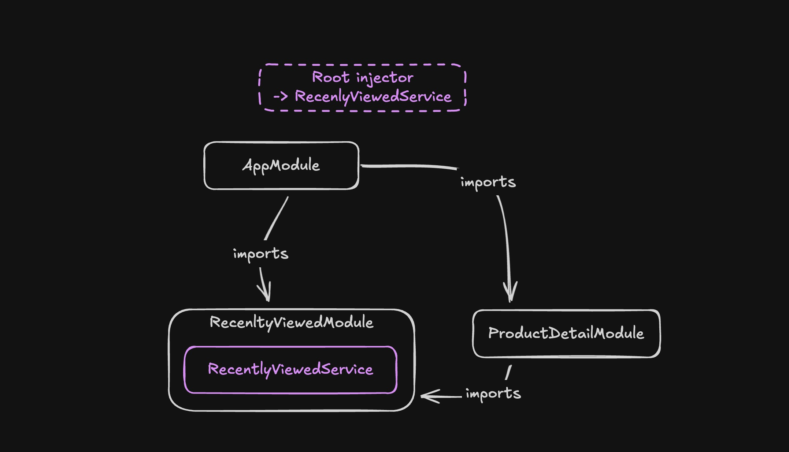
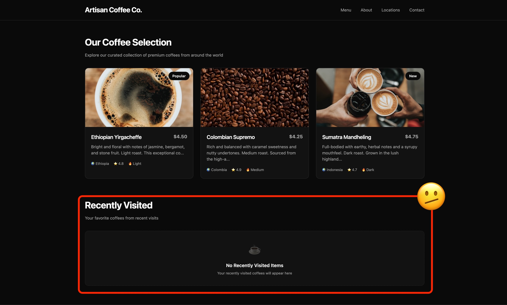
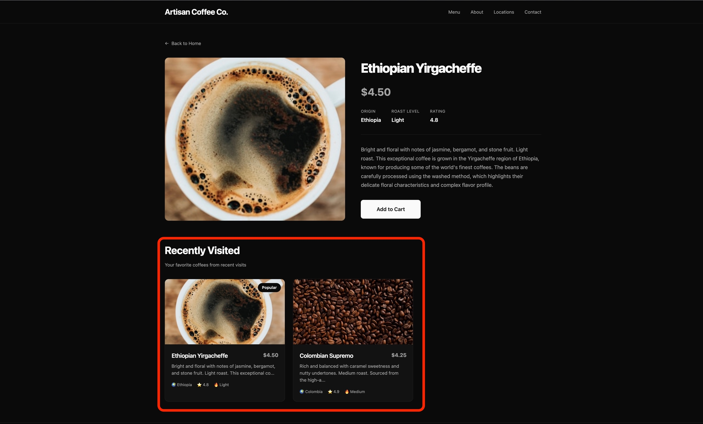
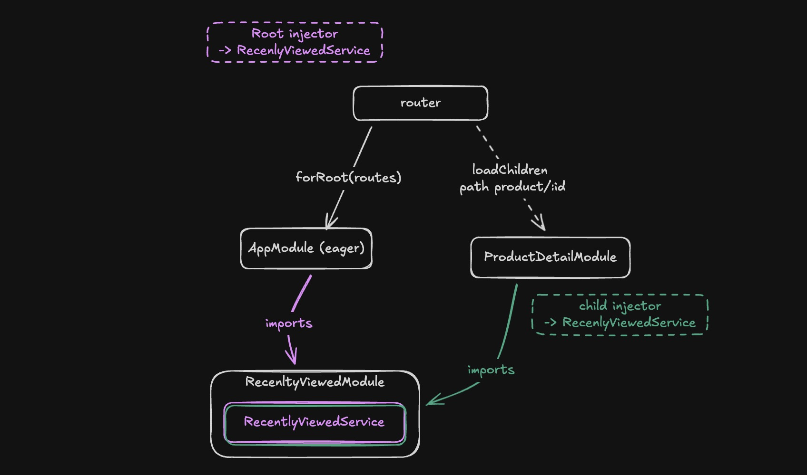

While refactoring a large Angular project that was still heavily relying on NgModules. After moving around some modules, I encountered a very strange bug. The build succeeded without errors, but at runtime, things started behaving strangely. No console errors. No TypeScript warnings. Just broken functionality.

After hours of debugging, I discovered the root cause: **a singleton service was being instantiated twice**—once in the root injector and once in a lazy-loaded module's child injector. This created two separate instances with their own isolated state, causing features that relied on shared state to silently fail. The culprit? Refactoring a module from eager to lazy loading had changed Angular's injector hierarchy, but there were no errors, no warnings—just broken functionality at runtime.

This is the story of how Angular's injector hierarchy can silently break your app when you refactor from eager to lazy loading, and how to prevent it.

## The Coffee Shop App: A Real-World Example


To demonstrate this issue, I built a simple coffee shop application. Users can browse coffees on the home page and click to view details. The app tracks recently visited products using a `RecentlyVisitedService` that maintains a list of the last 3 coffees viewed.

Here's the service implementation:

```ts
@Injectable()
export class RecentlyVisitedService {
  private readonly maxItems = 3;
  private _visitedCoffees = signal<Coffee[]>([]);

  readonly visitedCoffees = this.visitedCoffees.asReadonly();

  addVisitedCoffee(coffee: Coffee): void {
    // logic to add coffee to visitedCoffees
  }
}
```

Simple enough, right? The service uses a `signal` to maintain state. When you visit a product detail page, it adds that coffee to the list. The home page and product detail page display this list so users can quickly revisit products they've viewed.

## Scenario 1: Eager Loading (Everything Works)

Initially, both the home page and product detail page were eagerly loaded:

```ts
// app.module.ts
const routes: Routes = [
  { path: "", component: HomeComponent },
  { path: "product/:id", component: ProductDetailComponent },
];

@NgModule({
  declarations: [HomeComponent],
  imports: [
    RouterModule.forRoot(routes),
    RecentlyVisitedModule,
    ProductDetailModule,
  ],
})
export class AppModule {}
```

```ts
// product-detail.module.ts
@NgModule({
  declarations: [ProductDetailComponent],
  imports: [CommonModule, RouterModule, RecentlyVisitedModule],
  exports: [ProductDetailComponent],
})
export class ProductDetailModule {}
```

```ts
@NgModule({
  declarations: [RecentlyVisitedComponent],
  imports: [CommonModule],
  exports: [RecentlyVisitedComponent],
  providers: [RecentlyVisitedService], // 👈 Provides the service
})
export class RecentlyVisitedModule {}
```

**What happens here?** Both the homeCompnent and productDetailComponent show the RecentlyVisitedComponent. They both have to import the **RecentlyVisitedModule** ( which provides the RecentlyVisitedService) so they can add the component to their template. Angular creates **only one injector** for the entire application when everything is eagerly loaded. All providers from all eagerly loaded modules get merged into this root injector.

**Result:** You get a singleton. Both `HomeComponent` and `ProductDetailComponent` receive the same instance of `RecentlyVisitedService`. When you visit a product, it gets added to the list, and when you navigate back to home, the list is still there. ✅ Everything works perfectly.



> <a href="https://codesandbox.io/p/github/brampeirs/coffee-shop-eager/draft/focused-bash" target="_blank" rel="noopener noreferrer">Try it yourself: Eager Loading Demo on CodeSandbox</a> - Click on a coffee, then navigate back to see the "Recently Visited" section working correctly.

### A Critical Difference: NgModule Provider Flattening vs. Modern DI

This provider flattening behavior in eagerly loaded NgModules is actually **very different** from how Angular handles dependency injection in modern applications. It's important to understand this distinction because it explains why this bug is so surprising.

**In modern Angular (standalone components, route providers, component providers):**

If you provide the same service at multiple levels of the injector tree, you **always** get separate instances—regardless of lazy loading:

```ts
// Modern routing with providers
const routes: Routes = [
  {
    path: "parent",
    component: ParentComponent,
    providers: [MyService], // 👈 Instance #1
    children: [
      {
        path: "child",
        component: ChildComponent,
        providers: [MyService], // 👈 Instance #2 (always separate!)
      },
    ],
  },
];
```

The same is true for component-level providers:

```ts
@Component({
  selector: "parent",
  providers: [MyService], // 👈 Instance #1
})
export class ParentComponent {}

@Component({
  selector: "child",
  providers: [MyService], // 👈 Instance #2 (always separate!)
})
export class ChildComponent {}
```

**The behavior is consistent and predictable**: Each provider declaration creates a new instance in its own injector scope. Parent and child always get separate instances.

**But with NgModules and eager loading, Angular does something special:**

It **flattens** all providers from eagerly loaded modules into the root injector. This means that even though `RecentlyVisitedModule` is imported in multiple places, you still get a singleton—because Angular merges everything into one injector.

This flattening was meant to be helpful (share services easily!), but it creates a dangerous inconsistency: **the same code behaves differently depending on whether modules are eagerly or lazy loaded**. With eager loading, you get a singleton. With lazy loading, you get multiple instances.

This is why refactoring from eager to lazy loading can silently break your app—the DI behavior fundamentally changes, but there are no warnings.

## Scenario 2: Lazy Loading (Everything Breaks)

Now, let's say you want to improve performance by lazy loading the product detail page. You make what seems like a simple change to the routes:

```ts
// app.routes.ts
export const routes: Routes = [
  { path: "", component: HomeComponent },
  {
    path: "product/:id",
    loadChildren: () =>
      import("./product-detail/product-detail.module").then(
        (m) => m.ProductDetailModule
      ),
  },
];
```

The build succeeds. TypeScript is happy. You run the app and... it's broken.

When you click on a coffee to view its details, the product page loads fine. But when you navigate back to the home page, the "Recently Visited" section is empty. It's as if the app forgot you just viewed that product.




**What went wrong?**

When you lazy load the `ProductDetailModule`, Angular creates a **child injector** specifically for that lazy-loaded bundle. This child injector is separate from the root injector.

Here's the critical part: When `ProductDetailModule` imports `RecentlyVisitedModule`, and that module has `providers: [RecentlyVisitedService]`, Angular creates a **new instance** of `RecentlyVisitedService` in the child injector.

Now you have:

- **Instance #1** in the root injector (used by `HomeComponent`)
- **Instance #2** in the lazy module's child injector (used by `ProductDetailComponent`)

Each instance has its own `signal`, its own state, its own memory. They're completely isolated from each other.



> <a href="https://codesandbox.io/p/github/brampeirs/coffee-shop-eager/lazy" target="_blank" rel="noopener noreferrer">Try it yourself: Lazy Loading Demo on CodeSandbox</a> - Click on a coffee, then navigate back to home. Notice how the "Recently Visited" section is empty—the bug in action!

## Why This Is So Dangerous

The scariest part about this bug is that **there are no errors**. Your code compiles. Your tests might even pass (if they don't test cross-module interactions). The app runs without throwing exceptions.

The only symptom is that your app behaves incorrectly at runtime. Features that rely on shared state—like caching, user preferences, shopping carts, or in my case, recently visited items—silently break.

This is particularly insidious when refactoring:

1. **Your code worked before** (with eager loading)
2. **You make a "safe" performance optimization** (add lazy loading)
3. **The build succeeds** (no TypeScript errors)
4. **The app breaks** (but only at runtime, in subtle ways)

## Understanding NgModules and Injector Hierarchy

Before standalone components, Angular applications were built with NgModules—essentially LEGO boxes that bundled related functionality together.

**The good parts:**

- **Encapsulation**: A module could bundle a component, its template, styles, pipes, and services all in one place
- **Portability**: Import `UserModule` and get everything you need—no need to import 10 different files
- **Mental model**: Modules provided clear boundaries: "This is the Billing feature," "This is the Search feature"

**The Caveat: The "Providers" Trap**

In an NgModule, there's a massive conceptual difference between `declarations` (components/pipes) and `providers` (services):

- **Declarations are scoped**: If Module A declares a component, Module B cannot see it unless Module A exports it and Module B imports A. They stay in their "box."

- **Providers are (mostly) global**: Angular tried to be helpful by flattening providers. If you imported a module that had providers, Angular would usually merge those providers into the root injector so everyone could share them.

**...Until lazy loading enters the chat.**

The moment a module is lazy loaded, Angular draws a hard line in the sand. It creates a **child injector** (a separate dependency container) for that lazy module. Any providers declared in modules imported by the lazy module get instantiated in this child injector, creating new instances.

## The Solutions

Once you understand the problem, there are several ways to fix it:

### Solution 1: Use `providedIn: 'root'`

The modern, recommended approach is to use the `providedIn` metadata in the `@Injectable` decorator:

```ts
@Injectable({
  providedIn: "root", // 👈 Ensures singleton across the entire app
})
export class RecentlyVisitedService {
  // ... implementation
}
```

Then **remove** the service from the module's `providers` array:

```ts
@NgModule({
  declarations: [RecentlyVisitedComponent],
  imports: [CommonModule],
  exports: [RecentlyVisitedComponent],
  // providers: [RecentlyVisitedService], // ❌ Remove this!
})
export class RecentlyVisitedModule {}
```

**Why this works:** When you use `providedIn: 'root'`, Angular registers the service in the root injector directly, bypassing the module system entirely. This guarantees a singleton regardless of how modules are loaded.

**Benefits:**

- Tree-shakable (unused services can be removed by the bundler)
- Works with both eager and lazy loading
- The modern Angular way

### Solution 2: Use `forRoot()` Pattern

If you need to keep the service in the module (for example, if you need to configure it), use the `forRoot()` pattern:

```ts
@NgModule({
  declarations: [RecentlyVisitedComponent],
  imports: [CommonModule],
  exports: [RecentlyVisitedComponent],
})
export class RecentlyVisitedModule {
  static forRoot(): ModuleWithProviders<RecentlyVisitedModule> {
    return {
      ngModule: RecentlyVisitedModule,
      providers: [RecentlyVisitedService],
    };
  }
}
```

Then import it in your `AppModule` using `forRoot()`:

```ts
@NgModule({
  declarations: [App, HomeComponent],
  imports: [
    BrowserModule,
    RouterModule.forRoot(routes),
    RecentlyVisitedModule.forRoot(), // 👈 Only call forRoot() in AppModule
  ],
  bootstrap: [App],
})
export class AppModule {}
```

And in lazy-loaded modules, import it **without** `forRoot()`:

```ts
@NgModule({
  declarations: [ProductDetailComponent],
  imports: [
    CommonModule,
    RouterModule.forChild(routes),
    RecentlyVisitedModule, // 👈 No forRoot() here!
  ],
})
export class ProductDetailModule {}
```

**Why this works:** The `forRoot()` method returns the providers only when called. By convention, you only call it once in the root module. Lazy modules import the module without providers, so they use the existing instance from the root injector.

### Solution 3: Migrate to Standalone Components

The ultimate solution is to migrate away from NgModules entirely:

```ts
@Component({
  selector: "app-product-detail",
  standalone: true,
  imports: [CommonModule, RecentlyVisitedComponent],
  templateUrl: "./product-detail.component.html",
})
export class ProductDetailComponent {
  constructor(private recentlyVisitedService: RecentlyVisitedService) {}
}
```

With standalone components and `providedIn: 'root'`, you don't have to worry about module boundaries or injector hierarchies. Services are always singletons unless you explicitly provide them at the component level.

## Key Takeaways

🚨 **The Refactoring Trap:**

- **Eagerly loaded modules**: Providers are merged into the root injector → you get a singleton
- **Lazy-loaded modules**: Angular creates a child injector for the lazy bundle → if that module provides the same service, you get a new instance

⚠️ **This is why refactoring from eager to lazy loading can suddenly break your app**—the same code that worked before now creates multiple instances!

✅ **Best Practices:**

1. Always use `providedIn: 'root'` for singleton services
2. If using NgModules, use the `forRoot()` pattern for shared services
3. Consider migrating to standalone components to avoid these issues entirely
4. Test your app thoroughly after changing lazy loading boundaries

## Conclusion

Angular's injector hierarchy is powerful but can be confusing, especially when working with NgModules. The difference between eager and lazy loading creates a subtle trap that can break your app without any compile-time warnings.

The good news is that modern Angular has better solutions. With `providedIn: 'root'` and standalone components, you can avoid these pitfalls entirely. But if you're working with a legacy codebase that still uses NgModules, understanding how injector hierarchies work is crucial.

Next time you refactor routes to use lazy loading, remember: **check your services**. Make sure they're using `providedIn: 'root'` or the `forRoot()` pattern. Your future self (and your users) will thank you.

---

**Resources:**

- [Angular Dependency Injection Guide](https://v19.angular.dev/guide/di)
- [Hierarchical Injectors](https://v19.angular.dev/guide/di/hierarchical-dependency-injection)
- [Standalone Components](https://v19.angular.dev/guide/components/importing)
